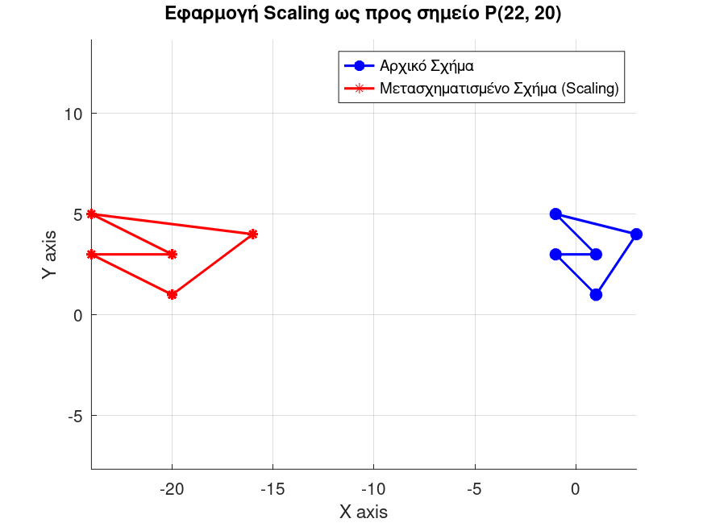

# 2D Affine Transformations using Homogeneous Coordinates

This module demonstrates the application of complex 2D spatial transformations by leveraging **Homogeneous Coordinates** and matrix multiplication.

## 🎯 Objective: Pivot-Point Scaling
Standard scaling algorithms operate relative to the origin $(0,0)$. To scale an object relative to an arbitrary pivot point $P(x_p, y_p)$, a **Composite Transformation Matrix** must be constructed. 

For this implementation, the pivot point is $P(22, 20)$ with scaling factors $S_x = 2$ and $S_y = 1$.

## 🧮 Mathematical Pipeline

The composite transformation is achieved in three distinct steps, combined via right-to-left matrix multiplication:

1. **Translation to Origin ($T_1$):** Move the pivot point to the origin.
$$T(-22, -20) = \begin{bmatrix} 1 & 0 & -22 \\ 0 & 1 & -20 \\ 0 & 0 & 1 \end{bmatrix}$$

2. **Scaling ($S$):** Apply the scaling factors.
$$S(2, 1) = \begin{bmatrix} 2 & 0 & 0 \\ 0 & 1 & 0 \\ 0 & 0 & 1 \end{bmatrix}$$

3. **Inverse Translation ($T_2$):** Move the system back to the original pivot point.
$$T(22, 20) = \begin{bmatrix} 1 & 0 & 22 \\ 0 & 1 & 20 \\ 0 & 0 & 1 \end{bmatrix}$$

### The Composite Matrix ($M$)
The final transformation matrix $M$ applied to the geometry is calculated as $M = T_2 \cdot S \cdot T_1$:
$$M = \begin{bmatrix} 2 & 0 & -22 \\ 0 & 1 & 0 \\ 0 & 0 & 1 \end{bmatrix}$$

By applying $M$ to the homogenous coordinates of the shape matrix, the entire polygon is transformed in a single, highly optimized vectorized operation.

## 🖼️ Visual Result

